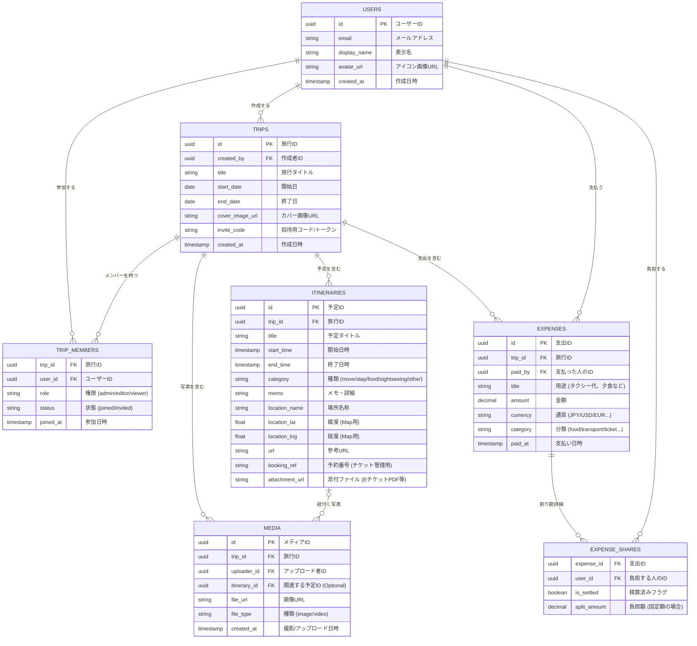

# TripLink データベース設計書 (Ver 1.0)

**プロジェクト**: TripLink  
**最終更新日**: 202X年X月X日  
**記述形式**: Mermaid (ER図)

---

## 1. 全体 ER図 (Entity Relationship Diagram)

## 2. テーブル詳細定義

### 2.1 USERS (ユーザー)
認証システム（Supabase Auth / Firebase Authなど）と連携する基本テーブル。

*   **id**: UUID。AuthプロバイダのIDと一致させると管理が楽。
*   **display_name**: グループ内で表示される名前。

### 2.2 TRIPS (旅行)
アプリの核となるテーブル。

*   **invite_code**: ランダムな文字列を生成して格納。`example.com/join?code=xxxx` のように使用する。
*   **cover_image_url**: 旅行一覧で見栄えを良くするための画像。

### 2.3 TRIP_MEMBERS (メンバー管理)
多対多の中間テーブル。

*   **role**:
    *   `admin`: メンバー招待・削除、旅行自体の削除が可能。
    *   `editor`: 旅程・支出の追加編集が可能（基本はこれ）。
    *   `viewer`: 閲覧のみ（将来的な拡張用）。

### 2.4 ITINERARIES (旅程・チケット)
スケジュールとチケット管理を統合したテーブル。

*   **category**: アイコンの出し分けに使用。
    *   `move` (移動: 飛行機、電車)
    *   `stay` (宿泊: ホテル)
    *   `food` (食事)
    *   `sightseeing` (観光)
*   **booking_ref / attachment_url**: チケット管理機能の実体。航空券の予約番号やPDFのURLをここに保持する。

### 2.5 EXPENSES & EXPENSE_SHARES (支出・割り勘)
割り勘計算を柔軟にするため、親子関係にする。

*   **EXPENSES**: 「誰が、いくら払ったか」という事実（レシート情報）。
*   **EXPENSE_SHARES**: 「その支払いは誰のためのものか」という内訳。

> **割り勘の例**:
> Aさんが3000円払った（Expensesレコード1つ）。
> 対象はA, B, Cの3人（Sharesレコード3つ）。
> ➡ これで「BさんはAさんに1000円借金がある」状態を計算できる。

### 2.6 MEDIA (思い出)
*   **itinerary_id**: 「この写真は『2日目のランチ』の時のもの」と紐付けるための外部キー（NULL許可）。
    *   Tripに直接紐付けることで、アルバム機能（Gallery）の実装を容易にする。

---

## 3. 設計のポイント（アジャイル対応）

### チケット管理テーブルを作らない理由
初期段階では `ITINERARIES` テーブルに `booking_ref`（予約番号）や `memo` カラムがあれば十分機能します。専用テーブルを作ると結合が複雑になるため、まずは単一テーブルでMVPを目指します。

### 通貨（Currency）カラム
海外旅行対応のため、金額だけでなく `currency` ('JPY', 'USD' etc.) を持たせています。MVPではJPY固定でも良いですが、DB設計には入れておくべきです。

### IDはUUIDを採用
連番（Integer）ではなくUUID（v4）を採用することで、推測されにくくし、分散DB（将来的なスケーリング）に対応しやすくしています。