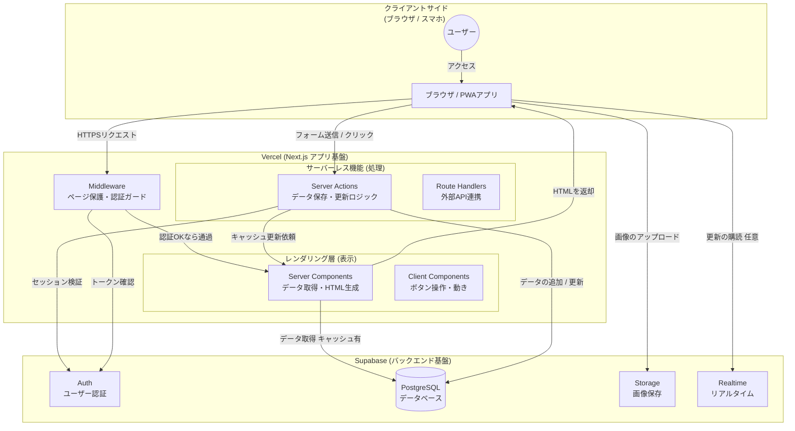
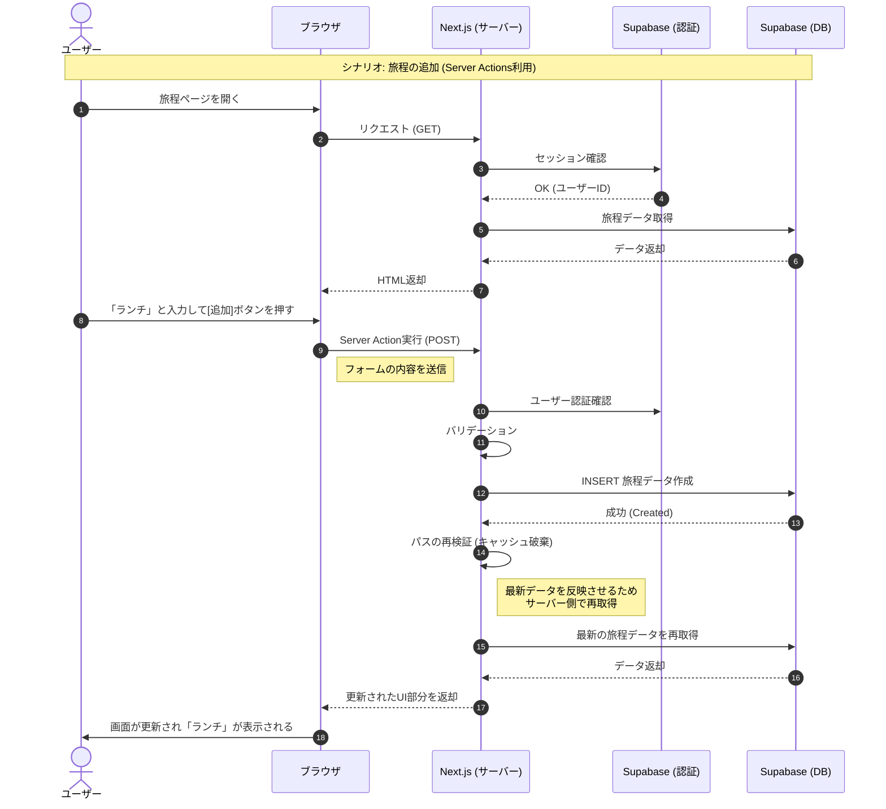
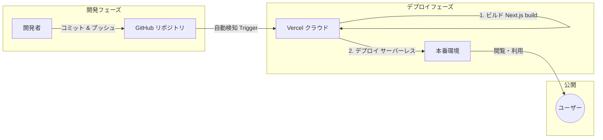

# TripLink システム構成図 & アプリケーションフロー

**技術スタック**: Next.js (App Router), Supabase 
**デプロイ先**: Vercel (フロントエンド/Edge), Supabase Cloud (バックエンド)

 

## 1. システム構成図 (アーキテクチャ)

Next.js の **Server Components** と **Server Actions** を中心に 
クライアント（ブラウザ）とSupabase（DB/Auth）をつなぐ構成

 

## 2. アプリケーション動作フロー (シーケンス)

ユーザーが**ログインして、旅程を追加する**時のデータの流れ

 

## 3. 開発・デプロイの流れ (CI/CD ワークフロー)
GitHubリポジトリに変更をプッシュするとVercelが自動検知、検証URL発行 
mainブランチにマージすると自動で本番環境にコードをデプロイ

